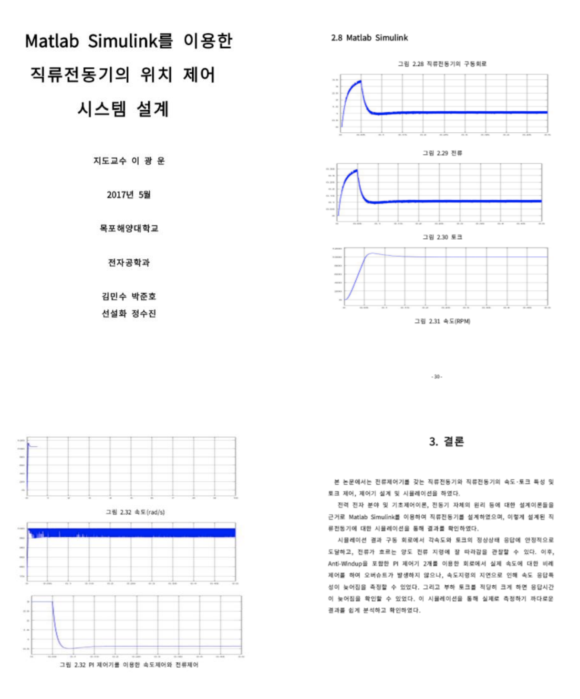
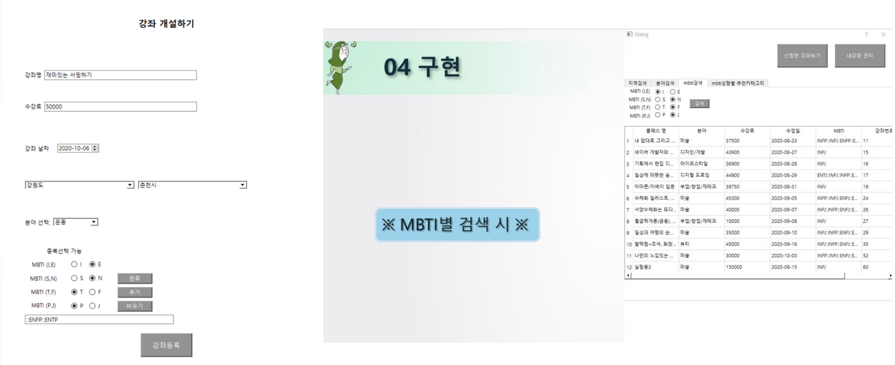
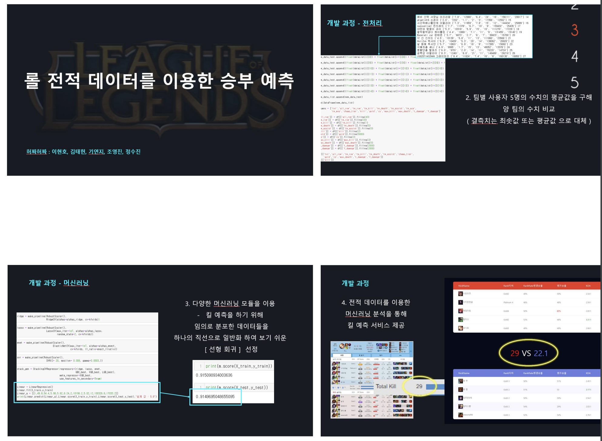
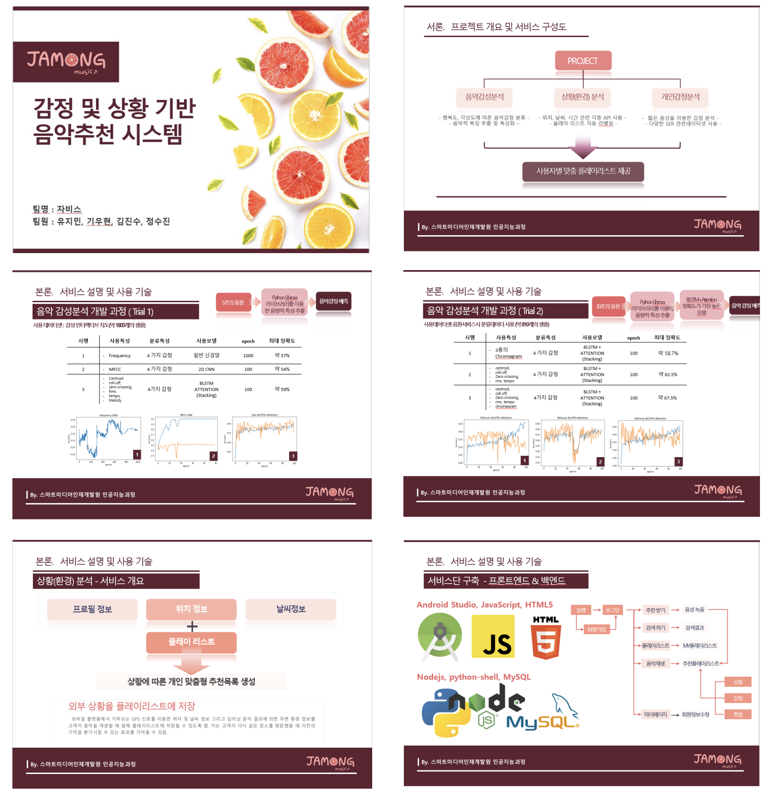

# 👩🏻‍💻 웹 개발자 정수진 프로필

## 📋 목차
1. [👋🏻 소개(Introduction)](#간단-소개)
    - [간단 소개(Introduce myself)](#간단-소개introduce-myself)
    - [학력(Education)](#학력education)
    - [언어(Languages)](#언어languages)
    - [자격증(Licenses & Certifcations)](#자격증licenses--certifcations)
2. [📚 교육(Course)](#교육course)
3. [💻 경력(Experience & Skills)](#경력experience--skills)

### 간단 소개(Introduce myself)
> 안녕하세요.  
> 빠른 적응력과 탁월한 커뮤니케이션 능력을 가진 현 웹 개발 2년차 정수진 입니다.

### 학력(Education)
- 광주여자고등학교
    - 졸업 년월 : 2013.02
-  목포해양대학교
    - 졸업 년월 : 2020.04
    - 학과 : 전자공학과
    - 졸업 논문

     

    - 

### 언어(Languages)
- English
    - Australia Working Holiday
    - Professional working proficiency
    - 기간 : 2018.12 ~ 2020.03

### 자격증(Licenses & Certifcations)
- 정보처리기사 필기
- 운전면허 2종 보통

### 교육(Course)
- [스마트인재개발원](https://smhrd.or.kr)
    - 교육 기간 : 2020.06 ~ 2020.11
    - 교육 과정 : 지역 전략 산업기반 인공지능 실무 인재 양성 과정
    - 교육 내용 : 인공지능, 빅데이터, 웹

 

> 취미 강좌 플랫폼에서 개인 성향을 고려한 강좌 추천 시스템 구현  

- 담당 역활 : 크롤링 데이터 전처리, 데이터 베이스 구축, 파이썬 GUI 개발(PyQT5)  
- 개발 언어 : Python, MySql  
- 개발툴 : JupyterNotebook

 

> 사용자의 전적 분석을 통해 승부를 예측하고, 전적 데이터를 바탕으로 전략을 추천하는 시스템 구현  

 
- 담당 역활 : 크롤링 데이터 전처리, 머신러닝(회귀모델) 구축, Web UI/UX, Node.js  
- 개발 언어 : Python, Html, Css, JavaScript, Flask, Node.js, MySql  
- 개발툴 : VS Code, JupyterNotebook

 

> 사용자 감정을 인식해 감정별로 음악을 추천해주며, 사용자의 위치와 날씨 정보를 받아와 상황별로 음악을 추천해주는 시스템 구현  

- 담당 역활 : 크롤링 데이터 전처리, Web UI/UX, 음악 감정 분석 딥러닝 모델링(일반 신경망, 2D CNN, BLSTM 모델) 구축  
- 개발 언어 : Python, Html, Css, JavaScript, Node.js, MySql  
- 개발툴 : VS Code, JupyterNotebook

### 경력(Experience & Skills)

1. 아이엠알(2021.01 ~ 2021.04)
    - 개발 언어 : Python, PostgreSQL
    - 개발툴 : PyCharm, pgAdmin
    - 협업툴 : Postman, Jira, Github
    - 프로젝트
        - 위급 상황 학습용 데이터 구축
        - 취약 계층을 위한 센서 데이터 수집 및 구축
2. 타이아 주식회사(2021.09 ~ )
    - 개발 언어 : Java, Spring, Jsp, JavaScript, Jquery, MsSql, PostgreSQL
    - 개발툴 : IntelliJ IDEA, Spring Tool Suite
    - 협업툴 : Subversion, Adobe XD, Zeplin
    - 프로젝트
        - 남동산단 스마트 물류플랫폼
        - 한국 와이다 프로젝트 개발
        - 현대, 기아 MES 프로젝트 유지보수
        - SIMTOS 두산 전시용 프로젝트 개발
        - 자사 프로젝트 개발
        - 동원시스템즈 프로젝트 개발